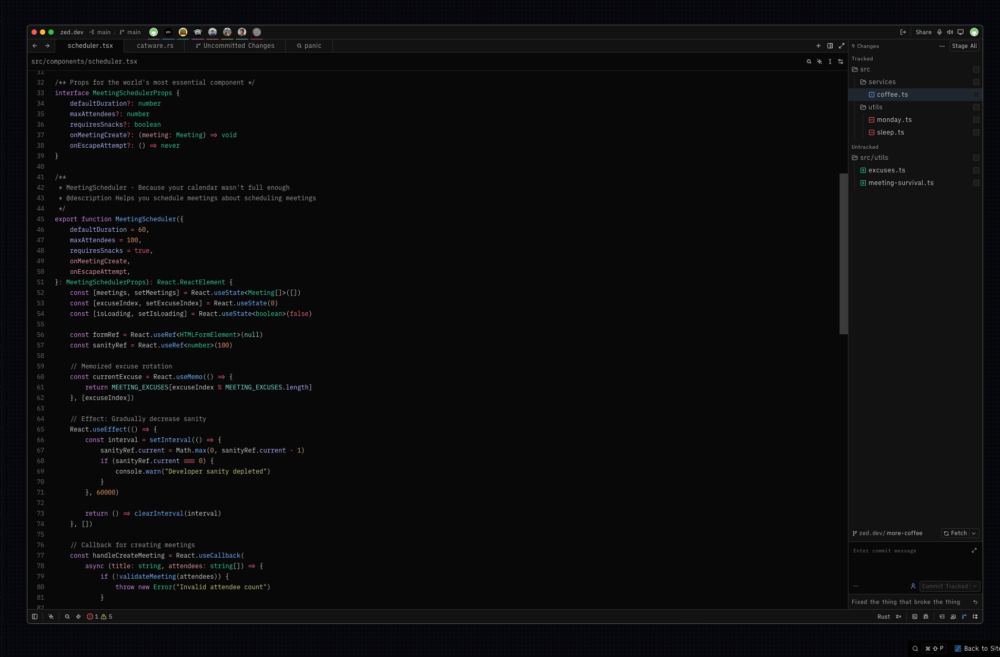
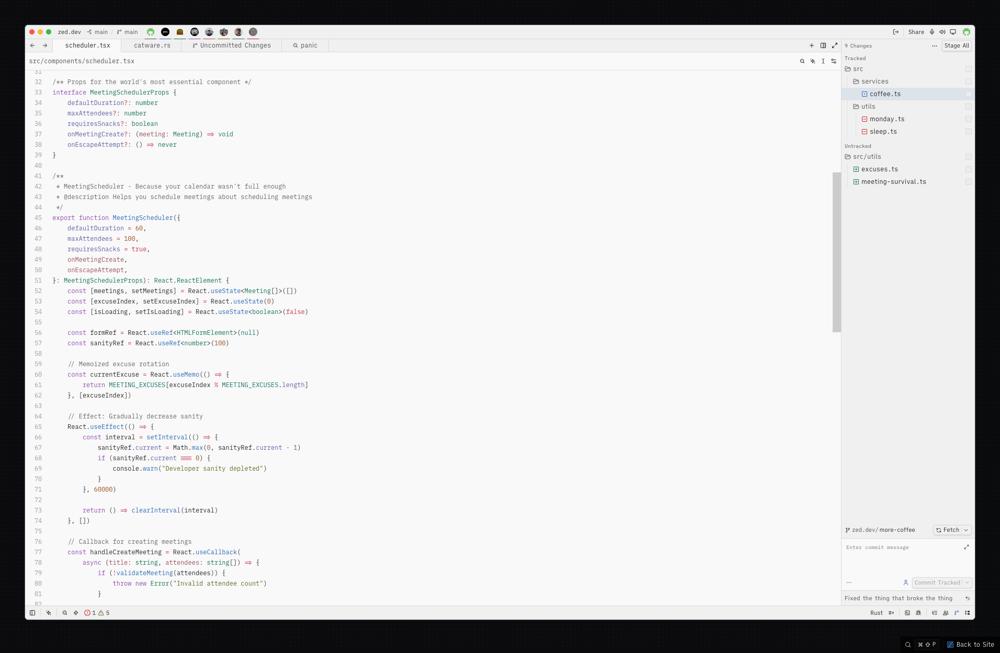

# Moonfly for Zed

A dark and light theme for [Zed](https://zed.dev), inspired by [bluz71/vim-moonfly-colors](https://github.com/bluz71/vim-moonfly-colors).

## Dark

## Light

## Credits

The color palette is based on [vim-moonfly-colors](https://github.com/bluz71/vim-moonfly-colors) by [bluz71](https://github.com/bluz71). All credit for the original design goes to them.

## License

[MIT](LICENSE)
